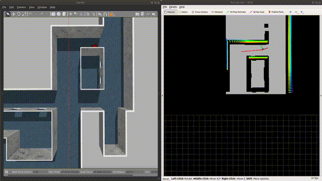

[toc]

# 一、环境配置

## qpOASES

qpOASES用于MPC求解，MPC用于轨迹跟踪

qpOASES二次规划求解器安装：

```bash
cd qpOASES
mkdir build
 cd build
 cmake ..
 sudo make
 sudo make install
```

## patchwork

patchwork用于地面分割，本规划器接受3d点云信息 **Pointcloud2** ，将点云进行地面分割后，再将点云投影至 2d 平面，构建 2d 栅格地图用于规划。

根据官方仓库中的readme配置环境：[patchworl_github](https://github.com/LimHyungTae/patchwork)

主要是下载可视化包 **jsk-visualization**

## 仿真环境

仿真环境使用CMU机器人研究所开源仿真环境，仿真环境中的meshes文件已经配置完成，安装相关库即可

[CMU-environment](https://www.cmu-exploration.com/)

# 二、 Quick Start

先启动仿真环境：

```bash
roslaunch vehicle_simulator system_indoor.launch
```

再启动规划器：

```bash
roslaunch ego_planner run_in_sim.launch
```

默认参数下，使用 rviz 自带插件 **2d nav goal** 即可设置目标




# 三、接口说明

## 需要的**topic**

1. 点云
   类型：`sensor_msgs/PointCloud2`
   话题：在 `plan_manage/run_in_sim.launch`  中修改参数：` <arg name="pointcloud_topic" value="/your_cloud_topic"/>`
2. odom
   类型：`nav_msgs::Odometry`
   话题：在 `plan_manage/run_in_sim.launch`  中修改参数： `<arg name="odom_topic" value="/your_odom_topic"/>`
3. 目标点
   类型：`geometry_msgs/PoseStamped`
   话题：话题：在 `plan_manage/run_in_sim.launch`  中修改参数： `<arg name="goal_topic" value="/your_odom_topic"/>`

**<font color = red>使用时请注意：以上的数据全部默认在map坐标系下</font>** 

## 输出

1. 运动量
   类型：`geometry_msgs/Twist`
   话题：**"/vel_cmd"**
   说明：该话题中仅有 **2** 个信息有效，**linear.x** 为小车坐标系下的前向线速度**(m/s)**，**angular.z** 为小车的自转角速度**(rad/s)**，实际控制需要再根据运动学模型进行求解

2. 可视化信息

   可视化信息详情请见运行程序后 **rviz** 中的信息，主要包括：

   (1) `/ego_planner_node/optimal_list` ：最终优化的局部轨迹

   (2) `/grid_map/occupancy_inflate` ：膨胀后的点云信息，用于构建膨胀的3d栅格地图

   (3) `/map_2d` ：结合地面分割后的点云和3d栅格地图后得到的2d栅格地图，是实际用于规划的地图


# 四、参数接口

  `plan_manage/launch/advanced_param.xml` 和   `plan_manage/launch/run_in_sim.launch` 文件中包含了绝大部分参数接口，下面<font color =red>**对可修改的参数**</font>进行说明，未特定说明的参数都是在 `advanced_param.xml` 中进行修改

## 1. 可修改的地图参数

可修改的地图参数如下：

```html
    <param name="grid_map/local_update_range_x"  value="8.0" />
    <param name="grid_map/local_update_range_y"  value="8.0" />
    <param name="grid_map/local_update_range_z"  value="1.5" />
    <param name="grid_map/map_size_x"   value="$(arg map_size_x_)" />
    <param name="grid_map/map_size_y"   value="$(arg map_size_y_)" />
    <param name="grid_map/map_size_z"   value="$(arg map_size_z_)" />
    <param name="grid_map/resolution"      value="0.1" />
     <param name="grid_map/obstacles_inflation"     value="0.3" />
```

`"grid_map/local_update_range_x/y/z"  ` : 局部规划范围，单位 m

`"grid_map/map_size_x/y/z"` : 全局地图尺寸，需要预设足够大的尺寸，`map_size_x_ `参数在 `run_in_sim.launch` 中修改，单位 m

`"grid_map/resolution"` ：**ego-planner** 内部构造栅格地图的分辨率

`"grid_map/obstacles_inflation"` ：障碍物膨胀尺寸


## 2. 可修改的规划参数

可修改的规划参数如下：

```html
<!-- planner manager -->
    <param name="manager/max_vel" value="$(arg max_vel)" type="double"/>
    <param name="manager/max_acc" value="$(arg max_acc)" type="double"/>
    <param name="manager/max_jerk" value="4" type="double"/>

<!-- trajectory optimization -->
<param name="optimization/dist0" value="0.4" type="double"/>
<param name="manager/control_points_distance" value="0.6" type="double"/>
<param name="optimization/max_vel" value="$(arg max_vel)" type="double"/>
<param name="optimization/max_acc" value="$(arg max_acc)" type="double"/>

<param name="bspline/limit_vel" value="$(arg max_vel)" type="double"/>
<param name="bspline/limit_acc" value="$(arg max_acc)" type="double"/>

```

`"manager/max_vel/acc/jerk"` : 规划和优化计算时所使用的**<font color =red>最大速度、加速度、加加速度限制</font>**，`max_vel/acc` 在`run_in_sim.launch` 中修改，单位 **m/s**

注意，上述两个限制只是**<font color =blue>规划和优化时</font>**的参数，而非<font color =red>**实际控制**</font>时的限制

`"optimization/dist0"`：优化计算时使用的安全距离参数，安全距离越大，优化的控制点将越远离障碍物，单位 **m**

`"manager/control_points_distance" ` ：控制点间距，在初始化时，每隔此间距，将生成一个控制点，即 B-spline 样本点，单位 **m**


## 4. 可修改的控制参数

```html
<!-- MPC controller  -->
<param name="MPC/v_max" value="1.5" type="double"/>
<param name="MPC/w_max" value="1.05" type="double"/>
```

`"MPC/v_max" `：机器人跟踪轨迹时的最大线速度，单位 **m/s**

`"MPC/w_max" `：机器人跟踪轨迹时：的最大角速度，单位 **rad/s**

设置的大小一般大于等于规划参数


# 五、性能评估

在 **waypoint** 设置合理的情况下，ego-planner 将具备良好的效果，但是在下述情况下，ego-planner 将规划出离谱的效果或者完全规划不出来：

1. 遇到大型障碍物的时候，例如房屋
2. 需要频繁切换方向的时候，做极限测试时，发现如果频繁切换 waypoint 并且方向差异较大的时候，将规划出很弯曲的轨迹

此外，地面分割的效果并不是特别理想，不如根据高度来判断的结果，后续还需要进行优化
