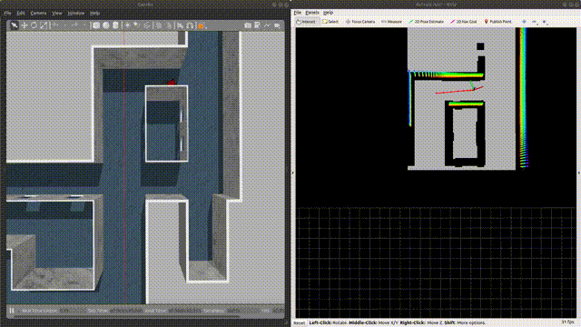

[toc]

# Environment Configuration

## qpOASES

We use qpOASES to solve MPC，and MPC is used for trajectory tracking

qpOASES  solver installation :

```bash
cd qpOASES
mkdir build
cd build
cmake ..
sudo make
sudo make install
```

## patchwork

patchwork is used for ground segmentation. This planner accepts 3d point cloud information **Pointcloud2**. After the point cloud is segmented on the ground, the point cloud is projected to the 2d plane to construct a 2d grid map for planning.

Follow the official repository to download this package：[patchworl_github](https://github.com/LimHyungTae/patchwork)

## Simulation environment

The simulation environment uses the open source simulation environment of the CMU Robotics Institute. Users  need to install the relevant libraries and download the mesh file. We recommend to use the indoor environment to test the planner.

The environment have two versions for ros-melodic and ros-noetic. The package in this project is for ros-melodic.

[CMU-environment](https://www.cmu-exploration.com/)

# Quick Start

First , start the simulation environment :

```bash
roslaunch vehicle_simulator system_indoor.launch
```

Second, start the planner :

```bash
roslaunch ego_planner run_in_sim.launch
```

In rviz , use  **2d nav goal** to set the goal :



If you can't see the imag in this file, you can see it in the folder "imag".


# 参数调整说明

在 CMU 提供的仿真环境中，小车并不具备真实的物理引擎，能够完全按照控制指令 (线速度 v 和角速度 w) 进行运动，这会影响到 MPC 控制器的参数设定

MPC 控制器的目标函数由两部分组成：跟踪误差和运动限幅。用户可以通过下面 4 个参数进行调整：

```xml
<!-- adjust in advanced_param.xml -->
<param name="MPC/v_max" value="1.8" type="double"/>
<param name="MPC/w_max" value="1.2" type="double"/>
<param name="MPC/omega0" value="1.0" type="double"/>
<param name="MPC/omega1" value="0.5" type="double"/>
```

`MPC/v_max` 与 `MPC/w_max` 与规划时设定的最大速度与加速度有关，可以设置成略大于规划最大速度 `max_vel` 的数值

`MPC/omega0` 和 `MPC/omega1` 分别为上述跟踪误差和运动限幅两项的权重：

1. `omega0` 越大，MPC 求解结果越倾向于减小误差，但有可能超过机器人的运动学极限
2. `omega1` 越大，MPC 求解结果越倾向于使得机器人的运动更平滑，但与参考轨迹之间的误差会增大

在 CMU 提供的仿真环境中，本人建议调大 `omega0`，因为该仿真环境中小车的运动不受限制

但在存在物理引擎的仿真环境中，建议适当调大 `omega1`，否则很容易出现角速度和线速度过大的现象，导致机器人运动不平滑

计划在分支中提供一版联合 SLAM 和具有物理引擎的仿真环境的 ego-planner，后面有时间整理后再上传

# 更新记录

- 2023.10.31

  修正了小车切换车头的 bug

  修正了 MPC 参数调整的 bug，添加了参数接口与说明

  添加了 CMU 仿真环境的 indoor 场景，用户可以直接测试，无需下载


# THANKS

We are very grateful for Fei Gao and the EGO-Planner he proposed. Our algorithm is implemented under their algorithm framework. If you are interested in our algorithm, you may see the origin algorithm in :

[EGO-Planner](https://github.com/ZJU-FAST-Lab/ego-planner)

